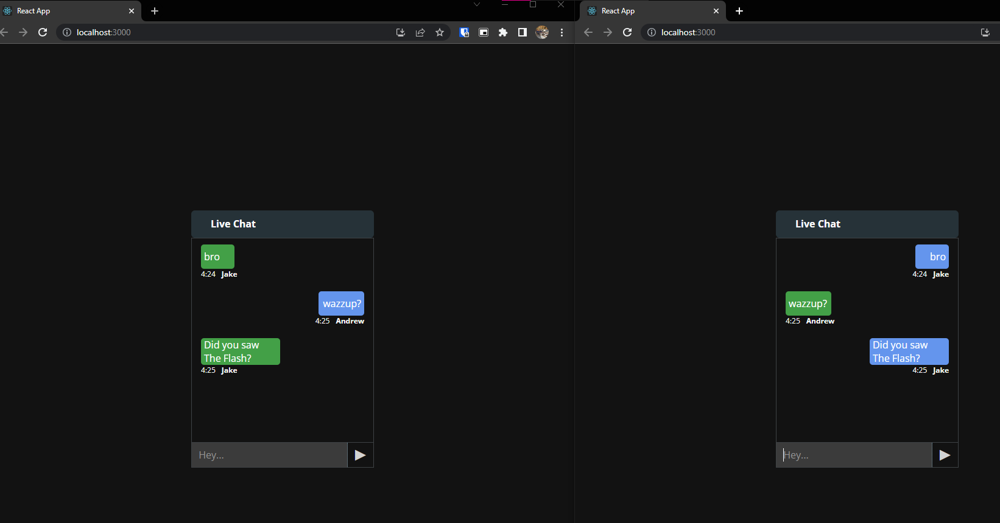

# Getting Started with this Chat App


  

In the project directory, go to `cd server`

### `npm start`

Run the same script on ```client``` directory as well.

Please make sure the room ID is the same so that 2 users can chat on each other.

Runs the app in the development mode.\
Open [http://localhost:3000](http://localhost:3000) to view it in your browser.

The page will automatically update after sending the message.
